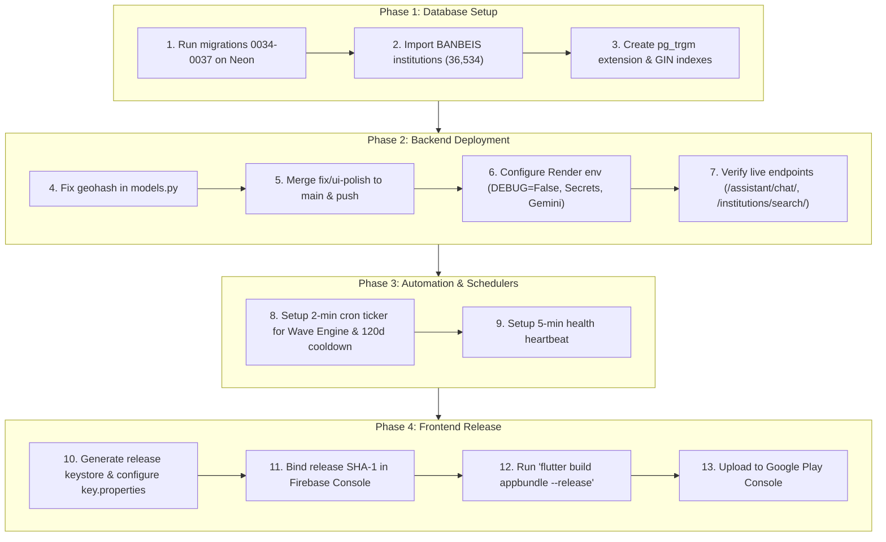

# 🩸 BloodPulse — Project Status & Final Deployment Roadmap
**Generated On:** October 2026  
**Repository:** `shawrab27/Blood-Donation`  
**Current Active Branch:** `fix/ui-polish` (27 commits ahead of `origin/main`)  
**Target Systems:** Flutter Client (Android/Web/iOS), Django REST Framework Backend, Neon PostgreSQL, Render Cloud, Vercel Proxy, Firebase Services.

---

## Executive Summary & Health Dashboard

| Subsystem | Health Status | Verification Status | Major Deployment Blocker |
| :--- | :---: | :---: | :--- |
| **Frontend (Flutter)** | 🟢 **Healthy** | 64/64 Tests Pass (`flutter test`), 0 Compile Errors | Release Keystore & Firebase SHA-1 binding for Google Auth |
| **Backend (Django REST)** | 🟡 **Needs Deployment** | 107/115 Tests Pass locally, all 27 feature commits ready | Live Render instance is **27 commits behind** (returns 404 for PulseAI & Institutions; `DEBUG=True` active) |
| **Database (Neon PostgreSQL)** | 🟡 **Pending Migrations** | Host active & connected (0001–0033 applied) | Migrations **0034 to 0037** unapplied; BANBEIS institutions (36,534) and `pg_trgm` GIN index not yet imported |
| **Reverse Proxy (Vercel)** | 🟢 **Healthy** | Live 200 OK (`https://blood-donation-liard.vercel.app/health/`) | Proxies to Render; needs cold-start latency mitigation |
| **Realtime Chat & Push (Firebase)** | 🟢 **Configured** | FCM & Auth configured | Firestore rules audit and release SHA-1 certificate sync required |

---

## 1. Frontend (Flutter) Deep-Dive

### 1.1 Current Architecture & Implementation Status
- **Framework & Libraries:** Flutter 3.x (Dart SDK `^3.12.2`), Flutter Riverpod `2.6.1`, GoRouter `17.3.0`, OpenStreetMap / `flutter_map 8.3.1`, Firebase Core/Auth/Messaging, Hive for local notifications cache.
- **Test Suite Results:**
  - **64 of 64 unit & widget tests passing** (`test/unit/*`, `test/widget/*`, `test/features/*`).
  - Covers: responsive layout scaling (320px–600px without overflow), BMI calculator math, institution autocomplete debouncing, unauthenticated route gating, authenticated incomplete user redirects, and notification message audits.
- **Static Analysis:**
  - `flutter analyze`: **0 Errors**, 3 Warnings (unused private helper declarations), 53 info deprecations (primarily Flutter's recent `Color.withOpacity` to `Color.withValues` migration).
- **UI Design System & Rule Compliance (.agents/AGENTS.md):**
  - **Top Bar Pattern:** Deep red `#C30121` title (Georgia font), circular logo, notification bell with unread badge counter, and profile avatar with active user photo or initials (no 3-dot menu).
  - **Persistent Bottom Navigation:** Exactly 5 tabs across main shell: *Feed*, *Blood Hub*, *Communities*, *Health Hub*, and *Profile*.
  - **Notification Center:** Exactly 4 tabs: *Feed*, *Request*, *Messages*, and *Profile*.
  - **Tokens & Shapes:** Pill capsules (`BorderRadius.circular(50)`), primary `#C30121`, secondary `#2B2B2B`, tertiary `#0D68AA`, surface `#FDF3F3`.
  - **PulseAI Widget:** ECG line CustomPaint floating widget with animated 1600ms loop, heartbeat status, and text-scale resilient sheet (1.0x and 1.3x safe).
  - **Institutions Typeahead:** Live autocomplete in registration supporting BANBEIS schools, colleges, madrasahs, and universities with free-text fallback.

### 1.2 Remaining Work for Final Frontend Deployment
- [ ] **1. Configure Android Release Keystore & Signing Config:**
  - In `blood_pulse/android/app/build.gradle.kts`, `release` build type is currently mapped to `signingConfig = signingConfigs.getByName("debug")`.
  - Generate a dedicated production keystore (`release-key.jks`), create `android/key.properties`, and switch the signing config to `signingConfigs.getByName("release")`.
- [ ] **2. Register Release SHA-1 / SHA-256 Fingerprints in Firebase:**
  - Extract the SHA-1 and SHA-256 from the release keystore.
  - Add both fingerprints into the Firebase Console (`bloodpulse-283dc`) Android App settings.
  - *Risk:* Without this, Google Sign-In throws `ApiException: 10` on production APK/AAB builds.
- [ ] **3. Verify API Base URL in Release Builds:**
  - `blood_pulse/lib/services/api_client.dart` defaults to `https://blood-donation-liard.vercel.app`.
  - Ensure release builds pass `--dart-define=API_BASE_URL=https://blood-donation-liard.vercel.app` or use the default constant.
- [ ] **4. Clean Up Deprecation & Warning Lints:**
  - Remove unused methods in `blood_hub_view.dart` (`_buildLiveDonorTrackingCard`, `_buildBloodGroupPill`).
  - Remove unnecessary cast in `feed_view.dart`.
  - Replace deprecated `Color.withOpacity()` with `Color.withValues(alpha: ...)` across UI screens.
- [ ] **5. App Store & Play Store Metadata:**
  - Verify app icons via `flutter_launcher_icons` for Android and iOS.
  - Update `version` in `pubspec.yaml` (e.g., `1.0.0+1` -> `1.0.0+2` for production release).
  - Generate production App Bundle: `flutter build appbundle --release`.

---

## 2. Backend (Django REST Framework) Deep-Dive

### 2.1 Current Implementation Status
- **Framework & Libraries:** Django 5.2.16, Django REST Framework, SimpleJWT (with token blacklisting), CorsHeaders, WhiteNoise, PyGeohash, Gemini Generative AI SDK, Brevo SMTP.
- **Branches & Commits:**
  - Working branch `fix/ui-polish` is **27 commits ahead** of `origin/main`.
  - Contains complete implementations of:
    - PulseAI Chatbot backend (`assistant/` app: knowledge base retrieval, medical Q&A triage, and rate limits).
    - BANBEIS Institution Search (`api/views_search.py`: trigram rank scoring, upazila and district filtering).
    - Wave Engine Escalation (`api/views_wave_engine.py`: automated wave radius progression, live pipeline, force escalation).
    - Trust & Fraud Engine (`api/views_trust_engine.py`: quarantine queue, trust score weights, ban/approve actions).
    - Brevo Email OTP Password Reset (`api/views_auth_reset.py`: HMAC OTP generation and validation).
    - Google Auth & Firebase UID deduplication and profile completeness gate.
- **Production Safety Guard:**
  - `safe_settings.py` prevents accidental execution of destructive commands (like `test`, `flush`, `migrate` without override) directly on Neon PostgreSQL without `ALLOW_PROD=1`.
- **Backend Test Status:**
  - 107 of 115 tests pass on local SQLite in dev mode.
  - The 8 failures are due to:
    1. SQLite concurrency table locks during multi-threaded race condition tests (`OperationalError: database table is locked: api_emailotp`).
    2. Lack of automatic geohash generation in `DonorProfile.save()` when lat/long are provided.
    3. OSM proxy throttle test cache leakage across test runs.

### 2.2 Critical Backend Deployment Issues
> [!WARNING]
> **Production Render Server is Outdated!**
> The live Render backend (`https://bloodpulse-backend.onrender.com`) is deployed from `origin/main`, which is **27 commits behind** `fix/ui-polish`.
> As a result:
> - `POST /api/assistant/chat/` returns **HTTP 404** on production.
> - `GET /api/institutions/search/` returns **HTTP 404** on production.
> - The live server displays Django debug tracebacks because `DEBUG = True` is currently active on Render.

### 2.3 Remaining Work for Final Backend Deployment
- [ ] **1. Merge `fix/ui-polish` into `main` & Push to Remote:**
  ```bash
  git checkout main
  git merge fix/ui-polish
  git push origin main
  ```
  This will trigger an automatic redeploy on Render.
- [ ] **2. Hardening Production Environment Variables on Render:**
  - `DJANGO_DEBUG=False` (Crucial: prevents leaking source code and internal tracebacks).
  - `DJANGO_ENV=production` (Enforces `SECURE_SSL_REDIRECT = True`).
  - `DJANGO_SECRET_KEY`: Set a unique, 50+ character random cryptographic secret key.
  - `DJANGO_ALLOWED_HOSTS=bloodpulse-backend.onrender.com,blood-donation-liard.vercel.app`
  - `GEMINI_API_KEY`: Add valid Google Gemini API key for PulseAI and lab report analysis.
  - `EMAIL_HOST_USER` and `EMAIL_HOST_PASSWORD`: Add Brevo SMTP credentials for OTP password resets.
  - `DATABASE_URL`: Point to the pooled Neon connection string.
- [ ] **3. Fix Geohash Generation in `DonorProfile.save()`:**
  - Ensure `DonorProfile.save()` automatically computes `self.geohash = pygeohash.encode(self.latitude, self.longitude, precision=12)` when `latitude` and `longitude` are provided.
- [ ] **4. Configure Background Wave Engine & Cooldown Cron Trigger:**
  - The wave engine (`/api/emergency/tick/`) and 120-day cooldown maintenance (`/api/emergency/maintenance-tick/`) need periodic triggers.
  - Set up a Render Cron Job, GitHub Action, or external cron webhook (e.g. cron-job.org) pinging every 2 minutes:
    - `POST https://bloodpulse-backend.onrender.com/api/emergency/tick/`
    - `POST https://bloodpulse-backend.onrender.com/api/emergency/maintenance-tick/`
- [ ] **5. Mitigate Render Free Tier Cold Starts:**
  - The free tier spins down after 15 minutes of inactivity, resulting in a 50+ second cold start that hurts urgent emergency blood requests.
  - Upgrade Render service to Starter ($7/mo) or configure a 5-minute keep-alive heartbeat ping to `/health/`.

---

## 3. Database (Neon PostgreSQL & Firestore) Deep-Dive

### 3.1 Current Status
- **Active Database:** Neon PostgreSQL (`ep-proud-dew-b3hhg1ea.c-4.ap-southeast-1.aws.neon.tech`).
- **Applied Migrations on Neon:** `0001_initial` through `0033_passwordresetotp_updates`.
- **Pending Migrations on Neon:**
  - `0034_add_google_auth_fields`: Google Auth profile columns (`google_uid`, `google_display_name`, `google_photo_url`, `auth_provider`).
  - `0035_add_fulfillment_fields`: Fulfillment columns (`auto_confirmed`, `donated_at`) on pledges, fake reports, and standby offers.
  - `0036_add_institution_fields`: Geographic hierarchy columns (`division_name`, `district_name`, `upazila_name`, `source_file`) on `Institution`.
  - `0037_institution_alias`: New `api_institution_alias` table with foreign key and index constraints.

### 3.2 Remaining Work for Final Database Deployment
- [ ] **1. Execute Pending Migrations on Neon:**
  Run against Neon with safety override:
  ```bash
  ALLOW_PROD=1 python manage.py migrate api 0034
  ALLOW_PROD=1 python manage.py migrate api 0035
  ALLOW_PROD=1 python manage.py migrate api 0036
  ALLOW_PROD=1 python manage.py migrate api 0037
  ```
- [ ] **2. Ingest BANBEIS Institution Records (36,534 Records):**
  ```bash
  ALLOW_PROD=1 python manage.py import_institutions
  ALLOW_PROD=1 python manage.py load_institution_aliases
  ```
  Verify count in Neon console:
  ```sql
  SELECT count(*), institution_type FROM api_institution GROUP BY institution_type;
  ```
- [ ] **3. Create Trigram Extension & GIN Indexes on Neon:**
  Run in Neon SQL Console to support sub-second fuzzy searches:
  ```sql
  CREATE EXTENSION IF NOT EXISTS pg_trgm;
  CREATE INDEX IF NOT EXISTS api_institution_name_trgm_idx ON api_institution USING gin (name gin_trgm_ops);
  CREATE INDEX IF NOT EXISTS api_institution_name_prefix_idx ON api_institution (name varchar_pattern_ops);
  ```
- [ ] **4. Configure Neon Connection Pooling (PgBouncer):**
  - Ensure the backend uses the pooled Neon database URL (Host ending in `-pooler.neon.tech` or port 6543) to prevent connection saturation during concurrent emergency requests.
- [ ] **5. Cloud Firestore Security Rules Audit:**
  - Harden `firestore.rules` for the real-time chat collections (`chat_rooms/{roomId}/messages/{messageId}`) to verify caller authentication and participant membership.

---

## 4. Final Deployment Execution Plan (Sequence of Operations)

Follow this precise sequence to take BloodPulse to 100% production readiness:



---

## 5. Deployment Verification Checklist

Once the steps are executed, verify the production system using this checklist:

| Verification Target | Command / Test | Expected Result |
| :--- | :--- | :--- |
| **Backend Health** | `curl -s https://blood-donation-liard.vercel.app/health/` | `{"status":"healthy"}` |
| **Assistant API** | `curl -X POST https://blood-donation-liard.vercel.app/api/assistant/chat/` | `400 Bad Request` or `401 Unauthorized` (Not 404!) |
| **Institution Search** | `curl "https://blood-donation-liard.vercel.app/api/institutions/search/?q=Dhaka"` | JSON results with matching schools/colleges |
| **Production Security** | Request non-existent route `/api/invalid-route/` | Clean 404 JSON, **NO** Django debug traceback |
| **Neon Institution Count** | `SELECT COUNT(*) FROM api_institution;` | `36534` |
| **Google Sign-In** | Sign in with Google on Release APK | Seamless token exchange, no `ApiException: 10` |
| **Emergency Wave Dispatch** | Trigger `/api/emergency/tick/` | 200 OK with processed counts |
